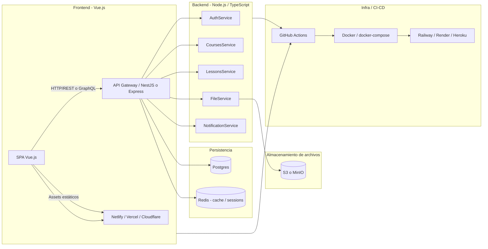

# Arquitectura del proyecto: Sistema-de-aprendizaje-Linux

> Documento generado para el repositorio: `CristianCortes1/Sistema-de-aprendizaje-Linux`.
>
> Contiene el diagrama de alto nivel (Mermaid), descripción de componentes, decisiones arquitectónicas, estructura de carpetas recomendada, y checklist para CI/CD y despliegue.

---

## Diagrama de alto nivel (Mermaid)

> Copia y pega este bloque en cualquier Markdown compatible (GitHub lo renderiza):



---

## Resumen ejecutivo

Este proyecto es una **plataforma de aprendizaje** con frontend en Vue (SPA) y backend en Node/TypeScript. La arquitectura propuesta busca:

- Separación clara entre **frontend** y **backend** (deploy independiente).
- Uso de **Postgres** para datos relacionales (usuarios, cursos, lecciones, progreso).
- **Almacenamiento de archivos** (videos, imágenes) en S3 o MinIO con URLs firmadas.
- **Redis** opcional para cache y manejo de sesiones/refresh tokens.
- Pipelines de **CI/CD** con GitHub Actions y despliegue a servicios como Netlify (FE) y Railway/Render (BE).

---

## Componentes y responsabilidades

### Frontend (carpeta `Frontend/`)
- SPA en **Vue.js** (+ TypeScript si aplica).
- Rutas principales: autenticación, catálogo de cursos, detalle de lección, perfil, dashboard de administración.
- Consume la API vía HTTP (REST o GraphQL) y obtiene assets estáticos de una CDN o storage.
- Build estático para Netlify/Vercel.

### Backend (carpeta `Backend/`)
- API en **Node.js** (recomendado: **NestJS** si usas TypeScript; alternativamente Express organizado en controladores/services/repositories).
- Módulos sugeridos: `auth`, `users`, `courses`, `lessons`, `uploads`, `notifications`.
- Autenticación: JWT + refresh tokens (guardados en DB o Redis).
- Validación de inputs: librerías tipo `zod` o `joi`.

### Persistencia
- **Postgres**: tablas principales (`users`, `roles`, `courses`, `lessons`, `progress`, `uploads`, `refresh_tokens`).
- **Redis**: cache de consultas pesadas, rate-limiting, session store o bloqueo distribuido.

### Almacenamiento de archivos
- **S3 / MinIO**: almacenar videos, imágenes y archivos pesados.
- Servir mediante **signed URLs** para control de acceso.
- CDN (Cloudflare, CloudFront, etc.) para entregar contenido estático con baja latencia.

### Infraestructura y DevOps
- **Contenerización**: Dockerfiles para frontend y backend; `docker-compose.yml` para entorno local.
- **CI/CD**: GitHub Actions para lint, tests, build y despliegue.
- **Entornos**: variables de entorno bien definidas para `development`, `staging`, `production`.

---

## Estructura de carpetas recomendada

```
/
├─ Frontend/
│  ├─ src/
│  │  ├─ components/
│  │  ├─ views/
│  │  ├─ store/
│  │  ├─ router/
│  ├─ public/
│  ├─ package.json
│  └─ README.md
├─ Backend/
│  ├─ src/
│  │  ├─ modules/
│  │  │  ├─ auth/
│  │  │  ├─ users/
│  │  │  ├─ courses/
│  │  │  ├─ lessons/
│  │  ├─ config/
│  │  ├─ migrations/
│  ├─ package.json
│  └─ README.md
├─ Documentacion/
│  └─ architecture.md
├─ docker-compose.yml
├─ .github/workflows/ci.yml
└─ README.md
```

---

## Decisiones arquitectónicas (por qué)

- **NestJS**: si usas TypeScript, NestJS ofrece organización modular, inyección de dependencias y buenas prácticas que aceleran el desarrollo y pruebas.
- **Postgres**: modelo relacional encaja bien con cursos, usuarios y relaciones (inscripciones, progreso).
- **S3 / MinIO**: evita almacenar binarios en la BD y mejora escalado.
- **Docker + docker-compose**: simplifica reproducibilidad local y facilita CI.
- **GitHub Actions**: integración nativa con GitHub; permite pipelines robustos sin infraestructura adicional.

---

## Recomendaciones de seguridad

- Forzar **HTTPS** en producción.
- Validación y sanitización de inputs en el servidor.
- **Rate limiting** y protección contra abuso (burst requests).
- Uso de **CORS** restringido a dominios conocidos.
- Rotación y almacenamiento seguro de secretos (no en el repo). Usar Secret Manager del proveedor o GitHub Secrets.
- Escanear dependencias (Dependabot o similar) y aplicar actualizaciones críticas.

---

## Tests y Calidad

- Tests unitarios para services y lógica de negocio (Jest).
- Tests de integración para rutas críticas (auth, creación de curso, subida de archivos).
- Linter (ESLint) y formateador (Prettier) en pipeline de CI.

---

## Ejemplos de archivos recomendados (snippets)

### `docker-compose.yml` (sugerencia mínima)

```yaml
version: '3.8'
services:
  backend:
    build: ./Backend
    env_file: .env.local
    ports:
      - '4000:4000'
    depends_on:
      - db
      - redis
  frontend:
    build: ./Frontend
    ports:
      - '3000:3000'
  db:
    image: postgres:15
    environment:
      POSTGRES_USER: postgres
      POSTGRES_PASSWORD: postgres
      POSTGRES_DB: learning
    volumes:
      - pgdata:/var/lib/postgresql/data
  redis:
    image: redis:7
    ports:
      - '6379:6379'
  minio:
    image: minio/minio
    command: server /data
    environment:
      MINIO_ROOT_USER: minio
      MINIO_ROOT_PASSWORD: minio123
    ports:
      - '9000:9000'
volumes:
  pgdata:
```

> Ajusta puertos y credenciales para desarrollo; nunca uses credenciales por defecto en producción.

---

## Pipeline mínimo de GitHub Actions (`.github/workflows/ci.yml`)

```yaml
name: CI

on:
  push:
    branches: [ main ]
  pull_request:
    branches: [ main ]

jobs:
  build:
    runs-on: ubuntu-latest

    steps:
      - uses: actions/checkout@v4
      - name: Set up Node.js
        uses: actions/setup-node@v4
        with:
          node-version: '20'
      - name: Install frontend deps & build
        working-directory: ./Frontend
        run: |
          npm ci
          npm run lint
          npm run build
      - name: Install backend deps & test
        working-directory: ./Backend
        run: |
          npm ci
          npm run lint
          npm test
```

---

## Checklist para llevar a producción

- [ ] Separar variables de entorno por entorno (dev/staging/prod).
- [ ] Configurar CI para deploy automático en `main` a staging y deploy manual a producción.
- [ ] Añadir backups automáticos de la base de datos.
- [ ] Configurar monitoring básico (logs centralizados, alertas de errores).
- [ ] Revisar y aplicar políticas de seguridad (WAF, rate-limits).

---

## Próximos pasos sugeridos (puedo generarlos ahora)

- `docker-compose.yml` completo y adaptado al repo.
- `.github/workflows/ci.yml` con deploy a Netlify / Railway.
- `README.md` raíz actualizado con comandos para levantar el proyecto localmente.

---

Si quieres que genere alguno de los archivos anteriores (por ejemplo, `docker-compose.yml` o el workflow de CI con deploy a Railway/Netlify), dímelo y lo creo listo para pegar en el repo.

